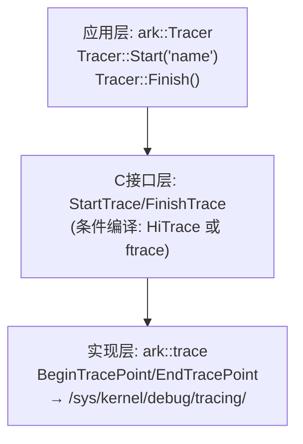

# ARK Runtime Trace 完整指南

> 本文档涵盖 Trace 系统的实现原理、使用方法、可视化工具和高级技巧

## 1. Trace 系统架构

### 1.1 三层架构

ARK 的 Trace 系统采用三层架构：



### 1.2 核心文件

| 文件 | 作用 |
|------|------|
| `runtime/trace.h` | Tracer 类定义，条件编译选择实现 |
| `libarkbase/trace/trace.h` | ark::trace 命名空间 API |
| `platforms/unix/libarkbase/trace.cpp` | ftrace 实现（Linux） |

### 1.3 关键实现细节

#### Tracer 类（runtime/trace.h）

```cpp
namespace ark {
class Tracer {
public:
    static void Start(const std::string &name, float limit = -1) {
        StartTrace(TRACER_TAG, name, limit);
    }
    
    static void Finish() {
        FinishTrace(TRACER_TAG);
    }
    
    static void Count(const std::string &name, int64_t count) {
        CountTrace(TRACER_TAG, name, count);
    }
};
}
```

#### 条件编译逻辑

**当未定义 `PANDA_USE_HITRACE` 时（Linux 默认）：**

```cpp
// runtime/trace.h
#include "libarkbase/trace/trace.h"

inline void StartTrace(uint64_t tag, const std::string &name, float limit = -1) {
    ark::trace::BeginTracePoint(name.c_str());  // 调用 ftrace
}

inline void FinishTrace(uint64_t tag) {
    ark::trace::EndTracePoint();  // 调用 ftrace
}
```

**当定义 `PANDA_USE_HITRACE` 时（HarmonyOS）：**

```cpp
#include "hitrace_meter/hitrace_meter.h"
// 使用 HiTrace API
```

#### ftrace 实现（platforms/unix/libarkbase/trace.cpp）

```cpp
// 初始化：检查环境变量
bool DoInit() {
    const char *pandaTraceVal = std::getenv("PANDA_TRACE");
    if (pandaTraceVal == nullptr || strcmp(pandaTraceVal, "1") != 0) {
        return false;
    }
    
    g_traceMarkerFd = open("/sys/kernel/debug/tracing/trace_marker", O_WRONLY);
    return g_traceMarkerFd != -1;
}

// 写入 trace 点
void DoBeginTracePoint(const char *str) {
    dprintf(g_traceMarkerFd, "B|%d|%s", getpid(), str);
}

void DoEndTracePoint() {
    dprintf(g_traceMarkerFd, "E|");
}
```

### 1.4 Trace 格式

ftrace 使用标准格式：

- **Begin**: `B|<pid>|<name>` - 开始一个 trace 点
- **End**: `E|` - 结束当前 trace 点（LIFO 栈结构）
- **Counter**: `C|<pid>|<name>|<value>` - 计数器类型

**关键特性：**
- ✅ **支持嵌套**：ftrace 使用栈结构，完全支持嵌套的 Begin/End 对
- ✅ **线程安全**：每个进程独立，通过 PID 区分
- ✅ **高性能**：写入内存 ring buffer，纳秒级延迟

### 1.5 嵌套 Trace 示例

```cpp
void MyFunction() {
    Tracer::Start("MyFunction");        // Begin "MyFunction"
    
    Tracer::Start("Step1");            // Begin "Step1"
    DoStep1();
    Tracer::Finish();                  // End "Step1"
    
    Tracer::Start("Step2");            // Begin "Step2"
    DoStep2();
    Tracer::Finish();                  // End "Step2"
    
    Tracer::Finish();                  // End "MyFunction"
}
```

**输出到 ftrace：**
```
B|1234|MyFunction
B|1234|Step1
E|
B|1234|Step2
E|
E|
```

**可视化效果（Perfetto）：**
```
MyFunction ┃ ████████████████████████
  Step1    ┃    ████
  Step2    ┃        ██████
```

---

## 2. 在 Linux 上抓取 Trace

### 2.1 前置条件

1. **WSL2/Linux 环境**
2. **Root 权限**（访问 `/sys/kernel/debug/tracing`）
3. **ftrace 已启用**（WSL2 默认启用）

### 2.2 完整流程

#### 步骤1：启动 ftrace 收集（终端1）

```bash
# 使用提供的脚本（WSL2 兼容）
sudo /path/to/scripts/trace_enable_wsl2.sh output.trace 60 8192

# 参数说明：
#   output.trace - 输出文件名
#   60 - 跟踪时长（秒），可随时 Ctrl+C 提前结束
#   8192 - 缓冲区大小（KB），默认 8MB
```

#### 步骤2：运行程序（终端2）

```bash
# 关键：必须设置环境变量 PANDA_TRACE=1
PANDA_TRACE=1 sudo -E ./your_program

# 注意：
# - 使用 sudo -E 保留环境变量
# - 或者直接在 root shell 中：
sudo su
export PANDA_TRACE=1
./your_program
```

#### 步骤3：查看结果

**方法1：Perfetto UI（推荐）**
1. 访问：https://ui.perfetto.dev/
2. 点击 "Open trace file"
3. 选择 `output.trace`
4. 查看可视化时间线

**方法2：Chrome Tracing**
1. 转换格式（如需要）：
   ```bash
   python3 ftrace_to_json.py output.trace output.json
   ```
2. 打开 `chrome://tracing`
3. 加载 `output.json`

### 2.3 WSL2 特殊说明

在 WSL2 中，`/sys/kernel/debug/tracing` 目录权限无法通过 `chmod` 修改，但：
- ✅ 以 root 身份可以直接访问
- ✅ `trace_marker` 文件本身是可写的
- ✅ 使用提供的 `trace_enable_wsl2.sh` 脚本（跳过权限设置）

### 2.4 验证 Trace 是否生效

```bash
# 检查 trace 文件中是否有您的标记
grep "fzw::GetClass" output.trace

# 检查是否有 trace_marker 写入
grep "tracing_mark_write" output.trace

# 如果都没有，检查：
# 1. 是否设置了 PANDA_TRACE=1
# 2. 程序是否真的调用了 Tracer::Start/Finish
# 3. 是否有 root 权限
```

---

## 3. Perf vs Trace 原理对比

### 3.1 Perf（采样）

#### 原理

```
时间轴 →
━━━━━━━━━━━━━━━━━━━━━━━━━━━━━━━━━━━━━
     ↓      ↓      ↓      ↓      ↓
   采样1   采样2   采样3   采样4   采样5
   
每次采样时：
1. 内核收到时钟中断（timer interrupt）
2. 读取 CPU 寄存器（RIP/EIP - 指令指针）
3. 遍历栈帧（stack unwinding）
4. 记录完整调用栈
```

#### 数据来源

- **寄存器**：RIP/EIP（当前执行位置）、RSP/ESP（栈指针）
- **栈内存**：返回地址链
- **符号表**：将地址转换为函数名
- **性能计数器**（PMU）：CPU cycles、cache miss 等

#### 特点

| 特性 | 说明 |
|------|------|
| **类型** | 被动采样（基于中断） |
| **精确度** | 统计性质（概率） |
| **开销** | 低（1-3% CPU） |
| **时序** | 无（只有采样点） |
| **因果关系** | 不清楚 |
| **短函数** | 可能丢失 |
| **侵入性** | 无需改代码 |
| **适用场景** | 找热点、CPU 分析 |

### 3.2 Trace（插桩）

#### 原理

```cpp
// 应用层写入
write(fd, "B|1234|FunctionName", ...);

// 内核层处理
1. 接收写入请求
2. 不落盘，直接写入 ring buffer（内存中）
3. Ring buffer 是无锁的 per-CPU 缓冲区
4. 极低开销（纳秒级）
```

#### Ring Buffer 结构

```
Per-CPU Ring Buffers（每个CPU一个，避免竞争）:

CPU0: [Event1][Event2][Event3]... → 循环覆盖
CPU1: [Event1][Event2][Event3]... → 循环覆盖
CPU2: [Event1][Event2][Event3]... → 循环覆盖
...

特点：
- 无锁（lock-free）
- 内存预分配
- 循环覆盖（可配置不覆盖）
- 每个 CPU 独立，无竞争
```

#### 性能对比

| 操作 | 延迟 |
|------|------|
| 普通 `printf` | ~1-10 µs（微秒） |
| 文件 `write` | ~1-5 µs |
| **ftrace marker** | **~50-200 ns（纳秒）** |
| **差距** | **快 10-100 倍！** |

#### 特点

| 特性 | 说明 |
|------|------|
| **类型** | 主动记录（函数调用时） |
| **精确度** | 精确（每次调用） |
| **开销** | 中（5-20%，取决于频率） |
| **时序** | 完整（精确顺序） |
| **因果关系** | 清楚（嵌套关系） |
| **短函数** | 不会丢失 |
| **侵入性** | 需要插桩 |
| **适用场景** | 找顺序、延迟分析 |

### 3.3 对比总结

| 维度 | Perf（采样） | Trace（插桩） |
|------|-------------|--------------|
| **原理** | 被动采样 | 主动记录 |
| **精确度** | 统计（概率） | 精确（每次） |
| **开销** | 低（1-3%） | 中（5-20%） |
| **时序** | 无 | 完整 |
| **因果关系** | 不清楚 | 清楚 |
| **短函数** | 可能丢失 | 不会丢失 |
| **侵入性** | 无需改代码 | 需要插桩 |
| **适用场景** | 找热点、CPU分析 | 找顺序、延迟分析 |
| **数据量** | 小 | 大 |

### 3.4 最佳实践：组合使用

```bash
# 第一步：用 Perf 找热点
perf record -g ./your_program
perf report --stdio
# 发现：GetClass() 占用 40% CPU

# 第二步：用 Trace 看细节
# 在 GetClass() 中加 trace 点
Tracer::Start("GetClass");
  Tracer::Start("LoadFromCache");
  Tracer::Finish();
  Tracer::Start("LoadFromDisk");
  Tracer::Finish();
Tracer::Finish();

# 发现：LoadFromDisk 很慢，需要优化
```

---

## 4. 自动插桩方案

### 4.1 需求场景

- ✅ 学习代码时，想完整看到执行过程
- ✅ 不想手动在每个函数加 Trace Start/Finish
- ✅ 希望自动插桩所有函数
- ✅ 函数名自动作为 trace 名称
- ✅ 可选地在某些函数附加更多信息（参数、检查点）

### 4.2 解决方案：GCC/Clang `-finstrument-functions`

#### 原理

编译器会在**每个函数的开头和结尾**自动插入对钩子函数的调用：

```cpp
// 源代码
void my_function(int x) {
    printf("x = %d\n", x);
}

// 编译器自动转换为（概念上）
void my_function(int x) {
    __cyg_profile_func_enter(my_function_addr, caller_addr);
    printf("x = %d\n", x);
    __cyg_profile_func_exit(my_function_addr, caller_addr);
}
```

#### 实现钩子函数

```cpp
extern "C" {
    // 函数进入钩子
    void __cyg_profile_func_enter(void *this_fn, void *call_site) {
        const char* func_name = GetFunctionName(this_fn);
        WriteTrace("B|%d|%s", getpid(), func_name);
    }
    
    // 函数退出钩子
    void __cyg_profile_func_exit(void *this_fn, void *call_site) {
        WriteTrace("E|");
    }
}
```

#### 编译选项

```bash
# 基本用法
g++ -finstrument-functions your_code.cpp

# 需要符号解析（获取函数名）
g++ -finstrument-functions -rdynamic -ldl your_code.cpp

# 排除某些函数（避免递归）
g++ -finstrument-functions \
    -finstrument-functions-exclude-file-list=trace.cpp \
    -finstrument-functions-exclude-function-list=__cyg_profile_func_enter
```

#### 控制粒度

```cpp
// 排除特定函数
void my_hot_function() __attribute__((no_instrument_function));

// 排除特定文件
#pragma GCC optimize("no-instrument-functions")
```

### 4.3 增强功能：记录参数和检查点

```cpp
// 提供宏用于记录额外信息
#define TRACE_ARGS(fmt, ...) \
    do { \
        char buf[512]; \
        snprintf(buf, sizeof(buf), fmt, ##__VA_ARGS__); \
        TraceHelper::LogArgs(__func__, buf); \
    } while(0)

#define TRACE_CHECKPOINT(msg) \
    TraceHelper::LogCheckpoint(__func__, msg)

// 使用示例
void ClassLinker::GetClass(const File& pf, EntityId id) {
    // 函数入口/退出由编译器自动处理
    
    // 记录关键参数（可选）
    TRACE_ARGS("file=%s, id=%x", pf.GetFilename(), id.GetOffset());
    
    Class *cls = pf.GetCache()->GetClass(id);
    if (cls != nullptr) {
        TRACE_CHECKPOINT("cache hit");  // 可选：记录检查点
        return cls;
    }
    
    TRACE_CHECKPOINT("cache miss");
    cls = LoadClass(...);
    return cls;
}
```

### 4.4 集成到 ARK 项目

#### CMakeLists.txt 配置

```cmake
# 添加自动插桩选项
option(ENABLE_AUTO_TRACE "Enable automatic function tracing" OFF)

if(ENABLE_AUTO_TRACE)
    # 添加编译选项
    add_compile_options(-finstrument-functions)
    
    # 排除 trace 系统本身
    set_source_files_properties(
        libarkbase/trace/auto_trace.cpp
        libarkbase/trace/trace.cpp
        PROPERTIES COMPILE_FLAGS "-fno-instrument-functions"
    )
    
    # 添加链接选项
    add_link_options(-rdynamic -ldl)
    
    # 定义宏
    add_definitions(-DENABLE_AUTO_TRACE)
endif()
```

#### 编译和运行

```bash
# 编译（启用自动插桩）
cmake -DENABLE_AUTO_TRACE=ON build
cmake --build build

# 运行（启用 trace）
PANDA_TRACE=1 sudo -E ./build/bin/ark your_program.abc
```

### 4.5 配置选项

| 环境变量 | 说明 | 默认值 | 示例 |
|---------|------|--------|------|
| `PANDA_TRACE` | 启用 trace | - | `PANDA_TRACE=1` |
| `TRACE_MAX_DEPTH` | 最大追踪深度 | 20 | `TRACE_MAX_DEPTH=10` |
| `TRACE_WHITELIST` | 白名单（只追踪匹配的）| - | `TRACE_WHITELIST=ClassLinker,LoadClass` |
| `TRACE_BLACKLIST` | 黑名单（不追踪匹配的）| - | `TRACE_BLACKLIST=mutex,lock` |

### 4.6 优缺点对比

| 方面 | 手动插桩 | 自动插桩 |
|------|----------|----------|
| **代码改动** | 每个函数都要加 | 零改动 |
| **覆盖率** | 容易遗漏 | 100% 覆盖 |
| **维护成本** | 高 | 零维护 |
| **灵活性** | 可以精确控制 | 通过白名单控制 |
| **参数记录** | 容易 | 需要宏辅助 |
| **性能开销** | 可控（只插需要的） | 较大（但可过滤） |

---

## 5. Trace 可视化

### 5.1 Perfetto UI（推荐）⭐⭐⭐

**访问地址**：https://ui.perfetto.dev/

**优势：**
- ✅ 直接支持 ftrace 格式（无需转换）
- ✅ 现代化 UI 界面
- ✅ 强大的分析功能
- ✅ SQL 查询支持
- ✅ 更好的大文件处理能力

**使用方法：**
1. 访问 https://ui.perfetto.dev/
2. 点击 "Open trace file"
3. 选择您的 trace 文件
4. 查看可视化时间线

### 5.2 Chrome Tracing

**访问地址**：`chrome://tracing`

**使用方法：**
1. 转换格式（如需要）：
   ```bash
   python3 ftrace_to_json.py output.trace output.json
   ```
2. 打开 Chrome 浏览器
3. 地址栏输入：`chrome://tracing`
4. 点击 "Load" 按钮
5. 选择 `output.json`

**快捷键：**
- `W/A/S/D` - 平移和缩放
- `1/2/3/4` - 选择工具
- `/` - 搜索事件
- `?` - 显示帮助

### 5.3 可视化效果示例

```
时间轴 →
━━━━━━━━━━━━━━━━━━━━━━━━━━━━━━━━━━━━━━━━━━━━━
线程1 ┃ ████████████ fzw::GetClass::panda_file ████
      ┃    ███ LoadClass ███
      ┃        ██ LinkMethods ██
━━━━━━━━━━━━━━━━━━━━━━━━━━━━━━━━━━━━━━━━━━━━━
线程2 ┃     ████████ AnotherEvent ████████
━━━━━━━━━━━━━━━━━━━━━━━━━━━━━━━━━━━━━━━━━━━━━
```

**可以看到：**
- ✅ 每个事件的开始和结束时间
- ✅ 事件之间的调用关系（嵌套）
- ✅ 不同线程的并行执行情况
- ✅ 热点分析（哪个函数最耗时）

---

## 6. 常见问题

### 6.1 Trace 没有输出

**检查清单：**
1. ✅ 是否设置了 `PANDA_TRACE=1` 环境变量？
2. ✅ 是否有 root 权限？（需要访问 `/sys/kernel/debug/tracing/trace_marker`）
3. ✅ 是否启用了 ftrace tracing？（运行 trace_enable_wsl2.sh）
4. ✅ 程序是否真的调用了 `Tracer::Start/Finish`？
5. ✅ 编译时是否启用了 `-DENABLE_AUTO_TRACE=ON`（如果使用自动插桩）？

**验证方法：**
```bash
# 检查 trace 文件中是否有您的标记
grep "fzw::GetClass" output.trace

# 检查是否有 trace_marker 写入
grep "tracing_mark_write" output.trace
```

### 6.2 编译错误：undefined reference

**错误：**
```
undefined reference to `ark::trace::internal::DoInt64TracePoint'
```

**解决：**
- 确保 `DoIntTracePoint` 和 `DoInt64TracePoint` 函数有 `PANDA_PUBLIC_API` 标记
- 检查链接了 `libarkbase.so`

### 6.3 WSL2 权限问题

**错误：**
```
chmod: changing permissions of '/sys/kernel/debug/tracing': Operation not permitted
```

**解决：**
- 这是 WSL2 的正常行为，不影响使用
- 使用 `trace_enable_wsl2.sh` 脚本（跳过权限设置）
- 以 root 身份运行即可直接访问

### 6.4 性能影响太大

**优化方案：**
1. 使用白名单：`TRACE_WHITELIST="ClassLinker"`
2. 限制深度：`TRACE_MAX_DEPTH=5`
3. 排除热路径：在函数前加 `__attribute__((no_instrument_function))`
4. 只在需要时启用：开发/学习时开启，生产环境关闭

### 6.5 Trace 文件太大

**解决方案：**
1. 使用 Perfetto UI（处理大文件能力更强）
2. 使用白名单/黑名单过滤
3. 限制追踪深度
4. 缩短追踪时间

### 6.6 嵌套 Trace 是否支持？

**答案：完全支持！**

ftrace 使用栈结构（LIFO）处理嵌套的 Begin/End 对：

```cpp
Tracer::Start("A");      // Begin A
Tracer::Start("B");      // Begin B
Tracer::Finish();        // End B
Tracer::Finish();        // End A
```

**输出：**
```
B|pid|A
B|pid|B
E|
E|
```

**可视化：**
```
A ┃ ████████████
B ┃    ████
```

---

## 7. 快速参考

### 7.1 基本使用

```cpp
// 在代码中添加 trace
Tracer::Start("MyFunction");
// ... 业务逻辑 ...
Tracer::Finish();
```

```bash
# 抓取 trace
sudo ./scripts/trace_enable_wsl2.sh output.trace 60 8192
PANDA_TRACE=1 sudo -E ./your_program

# 查看结果
# https://ui.perfetto.dev/ -> 打开 output.trace
```

### 7.2 自动插桩

```bash
# 编译
cmake -DENABLE_AUTO_TRACE=ON build
cmake --build build

# 运行
PANDA_TRACE=1 TRACE_WHITELIST="ClassLinker" sudo -E ./build/bin/ark app.abc
```

### 7.3 关键文件位置

| 文件 | 路径 |
|------|------|
| Tracer 类定义 | `runtime/trace.h` |
| ftrace 实现 | `platforms/unix/libarkbase/trace.cpp` |
| trace API | `libarkbase/trace/trace.h` |
| trace 脚本 | `scripts/trace_enable_wsl2.sh` |

### 7.4 环境变量速查

| 变量 | 作用 |
|------|------|
| `PANDA_TRACE=1` | 启用 trace（必需） |
| `TRACE_MAX_DEPTH=N` | 限制追踪深度 |
| `TRACE_WHITELIST="..."` | 只追踪匹配的函数 |
| `TRACE_BLACKLIST="..."` | 不追踪匹配的函数 |

---

## 8. 总结

### 核心要点

1. **Trace 系统架构**：三层架构，条件编译选择实现（HiTrace 或 ftrace）
2. **嵌套支持**：完全支持，ftrace 使用栈结构
3. **抓取方法**：设置 `PANDA_TRACE=1` + root 权限 + ftrace 脚本
4. **可视化工具**：推荐 Perfetto UI（https://ui.perfetto.dev/）
5. **自动插桩**：使用 `-finstrument-functions` 编译选项
6. **性能考虑**：可通过白名单/黑名单/深度限制控制开销

### 适用场景

- **学习代码**：使用自动插桩，完整追踪执行流程
- **性能分析**：先用 Perf 找热点，再用 Trace 看细节
- **调试问题**：使用 Trace 查看精确的调用顺序和时间
- **生产环境**：关闭 Trace 或使用白名单限制
