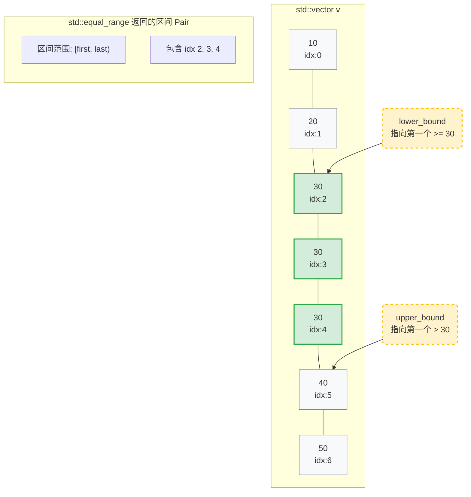

# C++ STL 二分查找算法全景指南

本文档整理了 C++ 标准库 (`<algorithm>`) 中所有基于二分查找原理的算法，以及现代 C++ (C++11/20) 中的进阶用法和性能陷阱。

## 1. 核心算法概览

所有这些算法的前提条件：**序列必须对于比较操作是已排序（或已分区）的**。

| 函数名 | 返回值 | 语义/作用 | 复杂度 |
| :--- | :--- | :--- | :--- |
| **`std::binary_search`** | `bool` | **只回答“在不在”**。不返回位置。 | $O(\log n)$ |
| **`std::lower_bound`** | `iterator` | 找**第一个 $\ge$ val** 的位置。常用于查找插入位置。 | $O(\log n)$ |
| **`std::upper_bound`** | `iterator` | 找**第一个 $>$ val** 的位置。常用于确定范围终点。 | $O(\log n)$ |
| **`std::equal_range`** | `pair<iter, iter>` | 同时返回 `lower_bound` 和 `upper_bound`。 | $O(\log n)$ |
| **`std::partition_point`** | `iterator` | **(C++11)** 找第一个**不满足**谓词的元素位置。 | $O(\log n)$ |

---

## 2. 详细解析

### 2.1 基础检查
#### `std::binary_search`
* **用途**：仅检查元素是否存在。
* **注意**：如果你之后需要访问该元素，**不要**用这个。用 `lower_bound` 代替，否则会进行两次 $O(\log n)$ 查找。

### 2.2 定位位置 (The "Big Three")
* **`lower_bound(begin, end, val)`**: 闭区间起点 `[`。
* **`upper_bound(begin, end, val)`**: 开区间终点 `)`。
* **`equal_range(begin, end, val)`**: 返回 `{first, second}`，即 `[lower_bound, upper_bound)`。区间长度即为等于 `val` 的元素个数。

### 2.3 广义二分查找 (隐藏的神器)
#### `std::partition_point` (C++11)
这是二分查找的通用形式。它不比较具体的值，而是根据一个**布尔谓词 (Predicate)** 进行二分。
* **前提**：数组必须是根据该谓词“已分区”的（所有 `true` 在前，所有 `false` 在后）。
* **返回值**：返回**第一个**让谓词为 `false` 的元素。
* **场景**：二分答案 (Binary Search on Answer)。例如，“找到第一个大于 X 的数”本质上就是 `partition_point`。

```cpp
std::vector<int> v = {1, 2, 3, 4, 5, 6, 7};
// 查找第一个大于 4 的数 (即使数组没排序，只要满足分区性质即可)
auto it = std::partition_point(v.begin(), v.end(), [](int i) {
    return i <= 4; // 前半部分满足 <= 4 (True)，后半部分不满足 (False)
});
// it 指向 5

## 3. 附录


